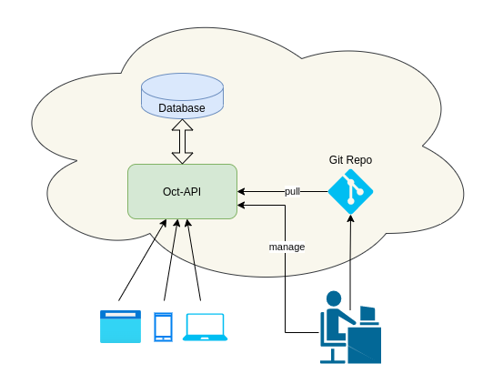
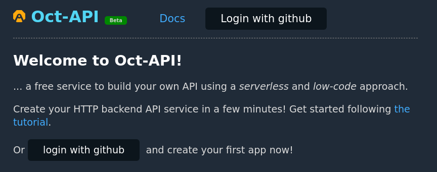
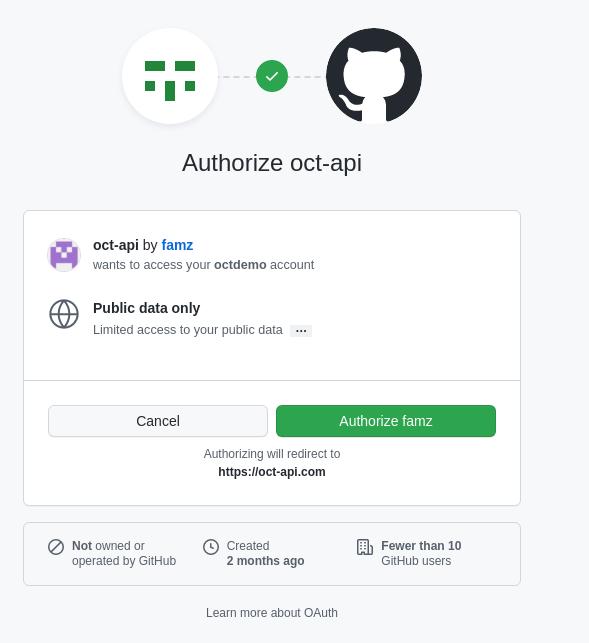
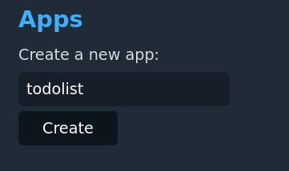
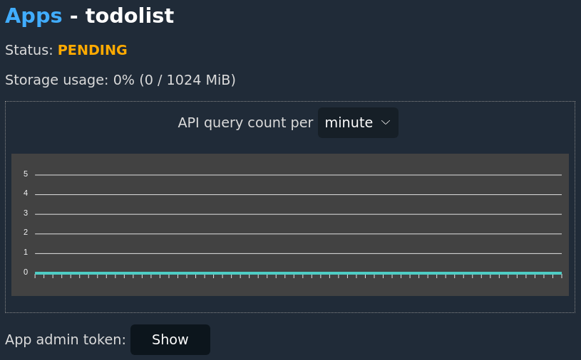
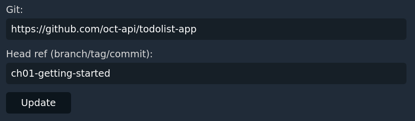
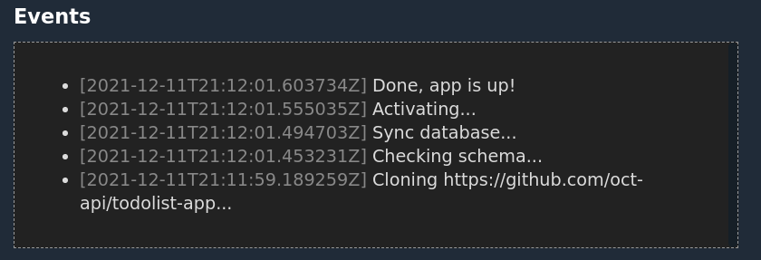
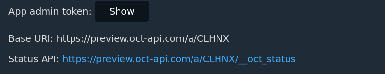
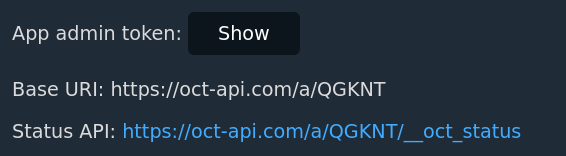

# Getting started

Welcome to Oct-API!

Oct-API is a cloud service that makes creating HTTP api services very easy. All
you need is a repo that defines your app data model and API access points; with
very little code, you can create a featureful backend and start servicing users.



In this tutorial we will build a simple todo list API, which allows you to
manage your project tasks or shopping list.

On Oct-API, an app is the unit to organize your application's elements, which
usually include database schema, API access points, authentication and
authorization, access rules, etc.

A git repo must be used to define an Oct-API app, that is the single source of
truth about your application. Using git allows you to easily integrate with
existing workflows and best practices such as code review, test automation,
CI/CD and many other devops tools.

Let's get started.

## Chapter 1: Creating your first app

### 1.1 Login

First, login to [Oct API](https://oct-api.com) with your GitHub account:



Click the authorize button in the pop-up window. This is only for
authentication purposes:



Once Oct-API is authorized to fetch your github account information, you will
be redirected back to Oct-API home page, and your user name will appear on the
page banner, as well as the link to your app dashboard:


### 1.2 Creating an app

Click "My apps" then create a new app by giving it a name:



Then click the app name, to visit the app page so that we can make some changes
to the now empty app.



The app is in PENDING status because "Git" and "Head ref" options are blank. We
will now fix this by creating the app definition. In order to do that, it's
time to create a git repo.

### 1.3 Creating app repo

The git repo must be hosted somewhere else that can be fetched by the Oct-API
server later, such as on GitHub.

> For convenience, the repo used in this step can be found on
[github](https://github.com/oct-api/todolist-app/tree/ch01-getting-started) so
that you don't have to create your own.

In your new git repo, create a new file named `app.yml` with following content:

```
meta:
  schema: v0.0.1
name: todolist
models:
  - name: TodoItem
    description: Record of an item on the todo list
    fields:
      - name: subject
        type: string
        description: Todo item subject
api:
  default_access: allow
  endpoints:
    - name: todo
      path: /todo
      type: model
      model: TodoItem
```

This YAML document defines a model which maps to a database table, and an API
endpoint through which clients can make requests. It will be parsed and
serviced faithfully by Oct-API.

Use `git add app.yml` and `git commit` to commit the change, then `git push` to
push it to your git server.

### 1.4 Sync repo

Once the git repo is ready, let's go back to the web interface and fill in the
URL and git ref:



Now we are ready to click the "Sync" button and bring the app to live! Look at
the bottom of the page to see the log and get insights of the update process:



### 1.5 Accessing API

The server will clone the specified repo and checkout the ref in the
background. After that, the app will start running.

Let's take a note of the displayed base URL so we can access the API later:




```
$ export API_BASE=https://oct-api.com/a/XXXXXX
```

Now if we refresh the page, or access the status API, we can see that the app's
state is `RUNNING`:

```
$ curl $API_BASE/todolist/__oct_status
{"status":"RUNNING"}
```

To access the todo list item API, simply send GET or POST requests to the URL
constructed with the base URI and your API endpoint path:

To get the list of items:

```
$ curl $API_BASE/todolist/todo
[]
```

To create a new item:

```
$ curl $API_BASE/todolist/todo -d '{"subject": "item 1"}'

$ curl $API_BASE/todolist/todo -d '{"subject": "item 2"}'

```

Let's fetch again to see that the items are created successfully:


```
$ curl $API_BASE/todolist/todo
[{"id":1,"subject":"item 1"},{"id":2,"subject":"item 2"}]

```

Or you can use DELETE to delete an item:

```
$ curl -X DELETE $API_BASE/todolist/todo -d '{"id": 1}'
```

## Chapter 2: Authorization

### 2.1 Default access mode

So far our new app allows anonymous access, so anyone on the internet can read
and modify the data. It is quite easy to test this way but definitely not a
good idea for any useful applications.

This is because we used this "open by default" policy in the app yaml:

```
api:
  default_access: allow
```

Let's fix it now. We remove the `default_access: allow` line from the yaml
file, commit the change (using `git commit -a` for example), push to the git
repo for the app if you have created one earlier.

This change will make Oct API deny access to the API endpoints by default
unless some authorization rules apply.  It has the same effect as setting it to
`deny`:

```
api:
  default_access: deny
```

If you used the example repo, you can continue to do so and use


```
https://github.com/oct-api/todolist-app ch02-auth
```

Remember to update your git repo and branch info in the app settings page, and
click update again. After the server synchronizes with the git, you will see
that anonymous access to the API is not possible:

```
$ curl -D - https://oct-api.com/a/QGKNT/todo
HTTP/2 401
date: Sun, 12 Dec 2021 21:47:15 GMT
content-type: text/plain; charset=utf-8
content-length: 16

Permission error
```

Now we don't have the risk of leaking or losing our data because of the earlier
insecure access policy.

### 2.2 Admin token

Then how do we access the data now? Oct API uses token based authentication,
and supports policy based access control at both API level and model level.
Before looking at some fine grained access control mechanisms, let's first get
some admin superpower.

Each app on Oct API has a unique admin token generated when the app is created.
Notice there is an admin token hidden by default on the app info page:




If we click the "Show" button we can see the token text and use it in our HTTP
header:

```
export ADMIN_TOKEN="YOUR_TOKEN_HERE"
curl -H "Authorization: token $ADMIN_TOKEN" https://oct-api.com/a/QGKNT/todo
```

_The format of the `Authorization` header is `token` + `$TOKEN_TEXT`, for example
`Authorization: token ABCDEFG`._

And we can get the same response as before:

```
[{"id":1,"subject":"item 1"}]
```

The admin token is the most privileged authorization and has permissions on the
entire app. So with the token passed in the header, we can read and write data
like before.

### 2.3 Creating a user

The users of our application don't need and shouldn't have admin privileges,
their data also needs to be separated between each other, which is basically
how any user account works.

So let's look at how to manage users of our app. Users are managed with
the `/auth/user` REST API under the app base URI. Currently there isn't any
user yet:

```
$ curl -H "Authorization: token $ADMIN_TOKEN" https://oct-api.com/a/QGKNT/auth/user
[]
```

Creating a user can be done by posting the essential fields to this API:

```
$ curl -H 'Authorization: token $ADMIN_TOKEN' https://oct-api.com/a/QGKNT/auth/user -d \
    '{"name":"exampleuser", "pass":"dummypassword", "email":"user@example.com","token":"demotoken123"}'
1
```

Now we can query the created user from the same API:

```
$ curl -H "Authorization: token $ADMIN_TOKEN" https://oct-api.com/a/QGKNT/auth/user
[{"name":"exampleuser","email":"user@example.com"}]
```

The user account which has a token is ready to be used in further requests to
our API with the same `Authorization` header format, but if we try it now we
would still get an permission error. This is because the default access policy
is too strict and there is no rule to allow unprivileged access yet. We will
look at how to address that next.

## Chapter 3: Access rules

There are two parts that play together and control access to the app in the
YAML file:

- At the API entry layer we specify which URL is open to what type of requests,
  i.e. authenticated requests by auth token, or anonymous requests
- At the model layer we specify which data records is visible to whom, i.e.
  does the authenticated user have access to certain records

This may seem a bit redundant at first because technically we can embed the
whole control in model layer since the authentication information is propagated
down anyway, but in practice there can be a couple drawbacks:

- An API entry may not always be backed by a model, it can be also static
  contents or other dynamic logic units that need access control as well.
- The HTTP semantics are much clearer if the API layer access control returns
  a 401 status, compared to an empty list returned from the model layer.

### 3.1 Updating access rules

In order to allow user access to the todo API and read/write database, we add
two fields in the app YAML:

- Add `visibility_scope: owner` to the model definition, as a sibling of the
  `fields`. This makes the database records (table rows) visible to their
  creators. Under the hood, a model always includes the creator's ID which is
  set automatically during a REST insert operation.
- Add an `access` section to the API entry. This is a list of rules that will
  be tried in order, if the condition matches, an action (deny or allow) will
  be taken. Here we specify `rule: user` to match all authenticated requests,
  and `action: allow` to admit and execute the request. If no rule matches, for
  example anonymous requests in this case, the default action will be taken,
  which is deny as mentioned above.

The final YAML content is as below:

```
meta:
  schema: v0.0.1
name: todolist
models:
  - name: TodoItem
    description: Record of an item on the todo list
    fields:
      - name: subject
        type: string
        description: Todo item subject
    visibility_scope: owner
api:
  endpoints:
    - name: todo
      path: /todo
      type: model
      model: TodoItem
      access:
        - role: user
          action: allow
```

As usual, commit and push the changes to the app's git repo, then update the
app.

The above definition is also available as

```
https://github.com/oct-api/todolist-app ch03-access
```

### 3.2 Creating user data

Now users can create their own records using their token:

```
$ export USER_TOKEN=demotoken123
$ curl -H "Authorization: token $USER_TOKEN" https://oct-api.com/a/QGKNT/todo -d \
    '{"subject": "user item 1"}'
```

While the new DB record will show up if we using admin token, the user can only
access the records owned by himself/herself:

```
$ curl -H "Authorization: token $USER_TOKEN" https://oct-api.com/a/QGKNT/todo
[{"id":2,"subject":"user item 1"}]
```
